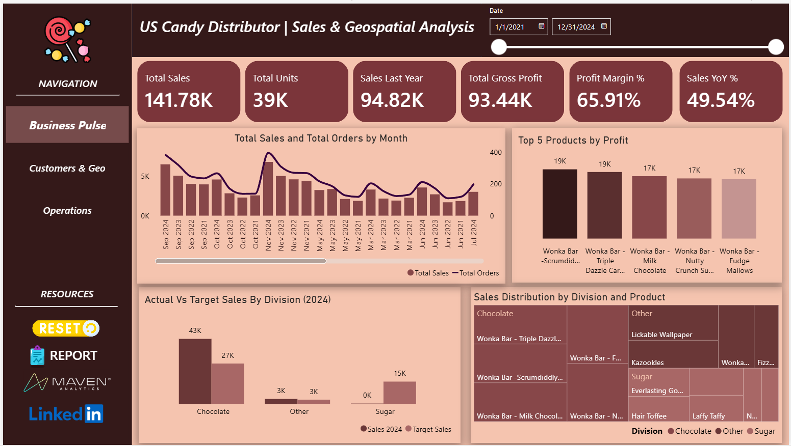
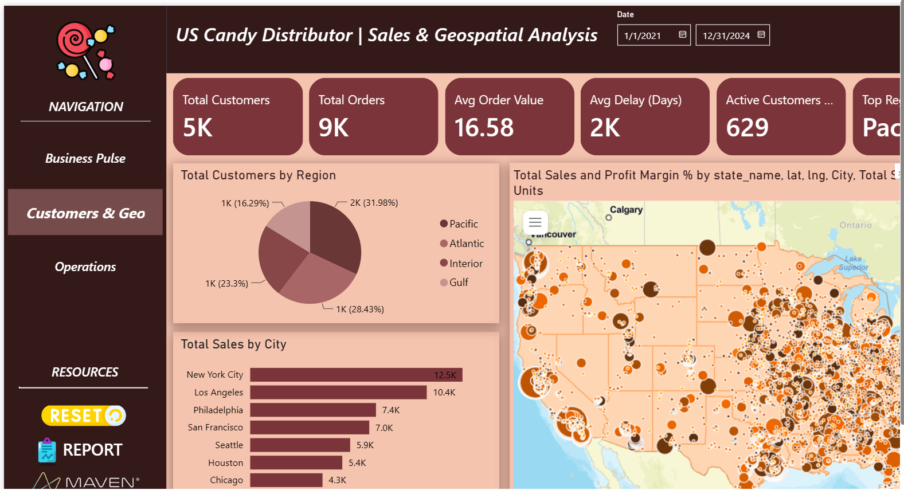
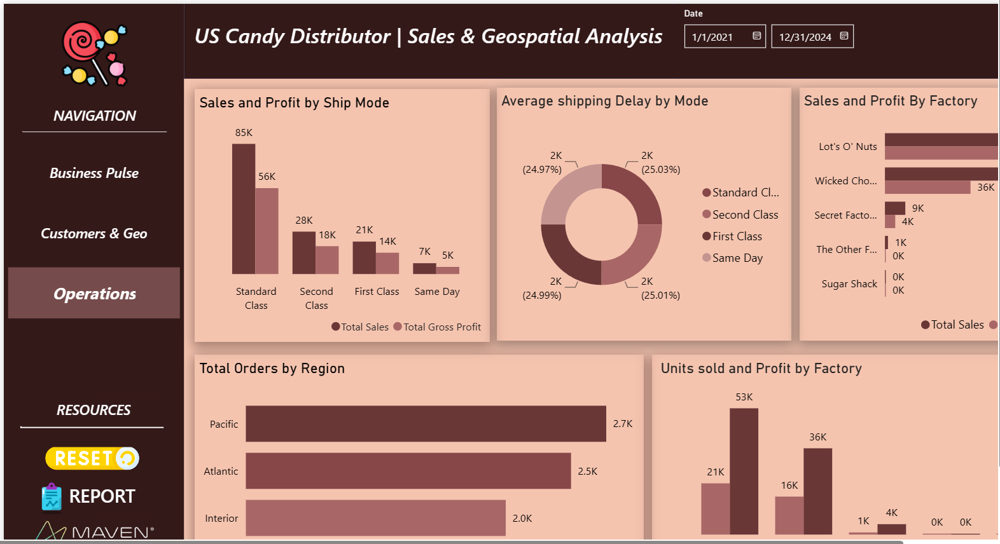

# 🍬 US Candy Distributor | Sales & Geospatial Analytics Dashboard


An end-to-end Business Intelligence dashboard built in Microsoft Power BI to analyze the sales, customer, operational, and geographic performance of a fictional US candy distributor. The project transforms raw transactional data into actionable business insights through interactive dashboards, data modeling, DAX calculations, and geospatial analysis.

## 📖 Project Overview

Modern businesses generate large volumes of transactional data, but deriving meaningful insights requires more than static reports. This project demonstrates how Power BI can be used to build an interactive decision-support system that enables stakeholders to monitor performance, identify trends, and make informed business decisions.

The dashboard consolidates data from multiple business domains—including sales, products, factories, customers, targets, and geographic information—into a unified analytical model. The report is designed to answer questions such as:

- Which products and divisions generate the highest revenue?
- Which regions contribute the most sales?
- Are sales targets being achieved?
- Which factories operate most efficiently?
- How effective are different shipping methods?
- How has business performance changed over time?

## 🎯 Project Objectives

The dashboard was developed with the following objectives:

- Analyze overall sales performance and profitability.
- Track sales trends using time intelligence.
- Identify top-performing products and business divisions.
- Compare actual sales against predefined 2024 targets.
- Evaluate customer distribution across regions.
- Perform geospatial analysis using ArcGIS Maps.
- Assess operational efficiency across factories.
- Measure shipping performance through delivery metrics.
- Build an intuitive dashboard with interactive navigation and filtering.

## 📊 Dataset Overview

The project combines multiple related datasets to build a complete business intelligence solution.


| Table               | Description                                                                                                                                              |
| ------------------- | -------------------------------------------------------------------------------------------------------------------------------------------------------- |
| **Candy_Sales**     | Transactional sales data containing Sales, Units, Gross Profit, Order ID, Customer ID, Shipping Mode, Order Date, Ship Date, Region, City, and ZIP Code. |
| **Candy_Products**  | Product information including Product Name, Category, Division, and Factory.                                                                             |
| **Candy_Factories** | Factory information used for operational analysis.                                                                                                       |
| **Candy_Targets**   | Division-wise sales targets for the year 2024.                                                                                                           |
| **Customers**       | Customer details and First Purchase Date.                                                                                                                |
| **Calendar**        | Date table created to enable time intelligence calculations.                                                                                             |
| **US ZIP Codes**    | Geographic reference dataset used for ArcGIS mapping.                                                                                                    |


## 🏗 Dashboard Development Workflow

The project followed a complete Business Intelligence pipeline.

```text
Raw Dataset
      │
      ▼
Power Query
(Data Cleaning & Transformation)
      │
      ▼
Data Modeling
(Star Schema)
      │
      ▼
Relationship Building
      │
      ▼
DAX Measures
      │
      ▼
Dashboard Design
      │
      ▼
Business Insights
```

## ⚙ Data Preparation

Data preprocessing was performed using Power Query before loading the data model.

#### Data Cleaning

- Verified data types
- Removed duplicate records
- Standardized categorical fields
- Validated relationships between tables

#### Data Transformation

- Created Delay Days from Order Date and Ship Date
- Built a dedicated Calendar table
- Structured lookup tables for products, factories, customers, and geography

## 🏛 Data Model

The dashboard follows a Star Schema.

### Fact Table

- Candy_Sales

### Dimension Tables

- Calendar
- Candy_Products
- Candy_Factories
- Customers
- Candy_Targets
- US ZIP Codes

This modeling approach improves query performance, simplifies DAX calculations, and enables consistent filtering across visuals.

## 📈 DAX Measures Implemented

Several reusable DAX measures were created to support dynamic reporting.

### Sales Measures

- Total Sales
- Sales 2024
- Sales Last Year
- Sales YoY %

### Profitability Measures

- Total Gross Profit
- Profit Margin %

### Customer Measures

- Total Customers
- New Customers
- Total Orders
- Average Order Value

### Operations Measures

- Total Units
- Average Delay (Days)
- On-Time Shipments %

### Geographic Measures

- Top Region

These measures respond dynamically to slicers, filters, and cross-highlighting, allowing users to explore different business scenarios without recalculating values.

## 📑 Dashboard Walkthrough

### 1. Business Pulse



The Business Pulse page serves as the executive overview of the business, providing a high-level summary of financial performance.

#### Key Features

- KPI Cards
  - Total Sales
  - Total Units
  - Sales Last Year
  - Total Gross Profit
  - Profit Margin %
  - Sales YoY %
- Monthly Sales and Order Trend
- Top 5 Products by Profit
- Actual vs Target Sales (2024)
- Product Sales Distribution Treemap

#### Business Questions Answered

- How is the business performing?
- Which products drive profitability?
- Are sales targets being achieved?
- How have sales changed over time?

### 2️. Customers & Geography



This page focuses on customer behavior and geographic performance.

#### Key Features

- Customer KPIs
- Regional Customer Distribution
- Top Cities by Sales
- ArcGIS Map
- Sales and Profit Margin by Location

#### Business Questions Answered

- Which regions contribute the most customers?
- Which cities generate the highest sales?
- Where are profitable markets located?
- How does geographic location influence business performance?

### 3️. Operations Analytics



This page evaluates operational efficiency across shipping modes and manufacturing facilities.

#### Key Features

- Sales & Gross Profit by Shipping Mode
- Average Shipping Delay
- Factory Performance
- Orders by Region
- Units Sold vs Gross Profit by Factory

#### Business Questions Answered

- Which shipping mode performs best?
- Which factories are most profitable?
- Does higher production lead to higher profit?
- Which regions generate the highest operational demand?

## 🌍 Interactive Features

The dashboard was designed for exploration rather than static reporting.

### Navigation Buttons

A custom navigation panel allows users to move seamlessly between dashboard pages.

### Date Slicer

Users can dynamically analyze data for different periods.

### Reset Button

A bookmark-driven Reset button restores the report to its default analytical state, clearing all applied filters with a single click.

### Cross Filtering

Every visual interacts with others, allowing users to drill into specific business segments without leaving the page.

### ArcGIS Maps

Geographic analysis is performed using ArcGIS Maps for Power BI, providing richer spatial insights than standard map visuals.

## 💡 Key Business Insights

The dashboard revealed several actionable insights:

- Chocolate emerged as the highest revenue-generating division.
- Milk Chocolate and Scrumdiddlyumptious Bars were among the highest-performing products.
- The Pacific region contributed the largest share of sales.
- Standard Class shipping achieved the best on-time delivery performance.
- First Class experienced the highest delivery delays.
- Higher production volume did not necessarily translate into higher profitability.
- Several business divisions fell short of their predefined 2024 sales targets, highlighting opportunities for strategic improvement.

## 🚧 Challenges Faced

Several technical and analytical challenges were addressed during development.

- Designing an efficient star schema from multiple datasets.
- Implementing accurate time intelligence using a dedicated Calendar table.
- Comparing actual sales with division-level target values for 2024.
- Configuring ArcGIS Maps using ZIP code reference data.
- Selecting visuals that provide unique analytical value rather than duplicating information.
- Implementing bookmark-based navigation and dashboard reset functionality.

## 🛠 Technology Stack

- Microsoft Power BI Desktop
- Power Query
- DAX (Data Analysis Expressions)
- ArcGIS Maps for Power BI
- Microsoft Excel

## 📂 Repository Structure

```text
US-Candy-Distributor-PowerBI/
│
├── Dashboard.pbix
├── README.md
├── Dataset/
├── Images/
│   ├── business-pulse.png
│   ├── customers-geo.png
│   └── operations.png
└── Report.pdf
```

## 🚀 Future Improvements

Potential enhancements include:

- Real-time database connectivity
- Sales forecasting using machine learning
- Customer segmentation through RFM analysis
- Inventory and supply chain analytics
- Predictive demand analysis
- AI-powered insights using Power BI Copilot

## 👨‍💻 Author

Subham Panigrahi

Computer Science Undergraduate 

LinkedIn: [https://www.linkedin.com/in/psubh/](https://www.linkedin.com/in/psubh/)

If this repository helped you understand Power BI dashboard development or business analytics, consider giving it a ⭐. Feedback and suggestions are always welcome.
